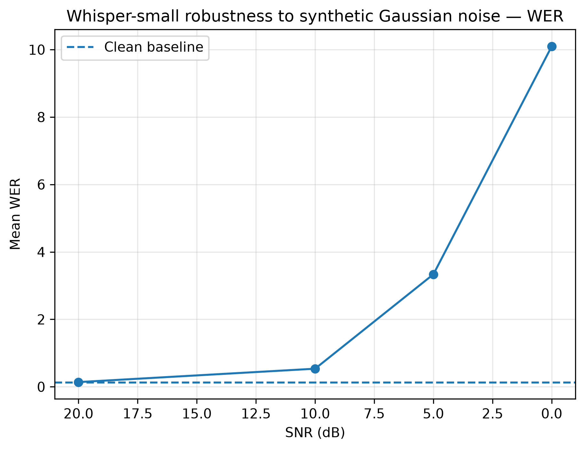
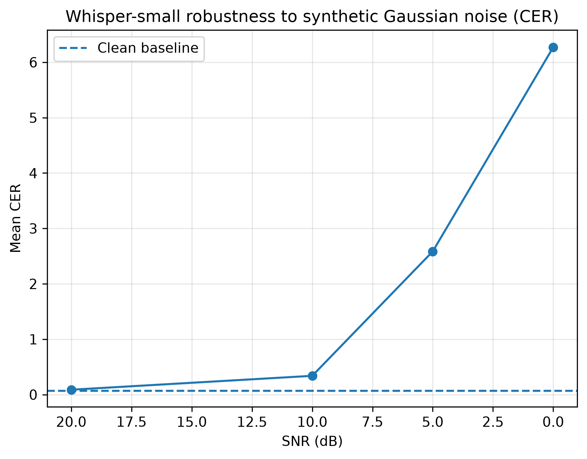

# Whisper Robustness to Synthetic Noise

A controlled pilot study evaluating the robustness of OpenAI Whisper-small
to synthetic Gaussian noise at different Signal-to-Noise Ratio (SNR) levels.

## Motivation

Automatic Speech Recognition systems often perform well on clean recordings,
but real-world audio can contain substantial noise.

This project investigates how the transcription performance of a pretrained
Whisper model changes as controlled Gaussian noise is progressively added to
speech signals.

The goal is not to benchmark Whisper comprehensively, but to build a
reproducible experimental pipeline for ASR robustness analysis.

## Model

- Model: `openai/whisper-small`
- Task: Automatic Speech Recognition
- Language: French
- Decoding language explicitly fixed to French
- Framework: Hugging Face Transformers / PyTorch

## Experimental setup

A small controlled set of 5 French speech recordings was used as a pilot
dataset.

For each recording, synthetic Gaussian noise was added at:

- Clean
- 20 dB SNR
- 10 dB SNR
- 5 dB SNR
- 0 dB SNR

Noise generation was made reproducible using deterministic random seeds.

The same underlying noise realization was scaled across SNR conditions for
each recording.

## Metrics

Two standard ASR metrics were used:

### Word Error Rate (WER)

WER measures word-level substitutions, deletions and insertions.

WER can exceed 1.0 when the model produces a large number of insertions.

### Character Error Rate (CER)

CER measures transcription errors at the character level and provides a more
fine-grained view of recognition quality.

## Results

| Condition | Mean WER | Median WER | Mean CER | Median CER |
|-----------|---------:|-----------:|---------:|-----------:|
| Clean     | 0.129 | 0.091 | 0.067 | 0.039 |
| 20 dB     | 0.139 | 0.091 | 0.088 | 0.125 |
| 10 dB     | 0.536 | 0.500 | 0.339 | 0.325 |
| 5 dB      | 3.337 | 0.917 | 2.586 | 0.538 |
| 0 dB      | 10.099 | 1.417 | 6.272 | 0.701 |

## WER degradation



## CER degradation



## Key observations

Whisper-small remained relatively stable under light synthetic noise at
20 dB SNR.

Performance degraded substantially at 10 dB.

Under severe noise conditions (5 dB and 0 dB), some samples triggered
catastrophic decoding failures with very large numbers of insertion errors.

The large difference between mean and median WER under severe noise indicates
that a few extreme decoding failures strongly influence the average.

Examples included repeated or excessively long autoregressive generations,
rather than only ordinary word substitutions.

## What I learned

This project connected several concepts from my Deep Learning training:

- audio waveforms and tensor representations
- pretrained Transformer models
- encoder-decoder architectures
- autoregressive decoding
- controlled data perturbation
- Signal-to-Noise Ratio (SNR)
- random seeds and reproducibility
- WER and CER evaluation
- experimental design
- quantitative and qualitative error analysis

## Project structure

```text
asr_robustness/
├── notebooks/
├── results/
│   ├── clean_results.csv
│   ├── noisy_results.csv
│   ├── summary_metrics.csv
│   ├── worst_failures.csv
│   ├── wer_vs_snr.png
│   └── cer_vs_snr.png
├── data/
└── README.md


Limitations
This is a small controlled pilot experiment using only five recordings from
one speaker and synthetic Gaussian noise.
The results should therefore not be interpreted as a general benchmark of
Whisper.
Future extensions could include:
- public speech datasets
- multiple speakers
- real-world environmental noise
- additional languages
- low-resource African languages
- comparison with other ASR architectures


Conclusion
The experiment shows that Whisper-small can remain robust under moderate
synthetic noise, while severe signal degradation can cause both ordinary ASR
errors and extreme autoregressive decoding failures.
More importantly, the project provides a reproducible pipeline for studying
ASR robustness under controlled perturbations.